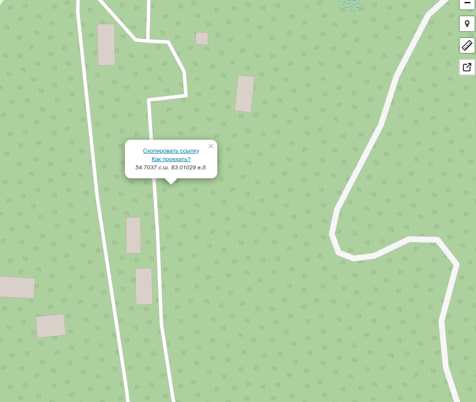

## Образование
Сибирский государственный университет телекоммуникаций и информатики
2-ой курс 
Направление: "Программное обеспечение мобильных систем"

##  Список навыков в области программирования\IT.
- Программирование на СИ
- Знание linux. Работа в bash

## Выполненные\участие в проектах
- Проект Decimal 

- Проект SmartCalc

- Проект 3dViewer

# Задание для 5 лабораторной работы
преобразования системы координат в “Земную”

- в этой функции мы сопостовляем нашу карту 100 * 100  с долготой и широтой ( изменил вместо 1000 * 1000, чтобы для большей масштабируемости при работе с градусами )
- считаем координаты центра по долготе и широте. На карте это (0,0). 
- Считаем шаг.    
    на карте - это 1. В случае с градусами считаем дельту, затем делим ее на 100 ()
- наша координата является коэффицентом для умножения на шаг.
  Коэффицент - это кол-во шагов в одно направление.
- насколько мы смешаемся от центра
    Считается так: Координата центра + Дельта.   
    Дельта = шаг * кол-во шагов 

# Карта с приблизительными координатами
